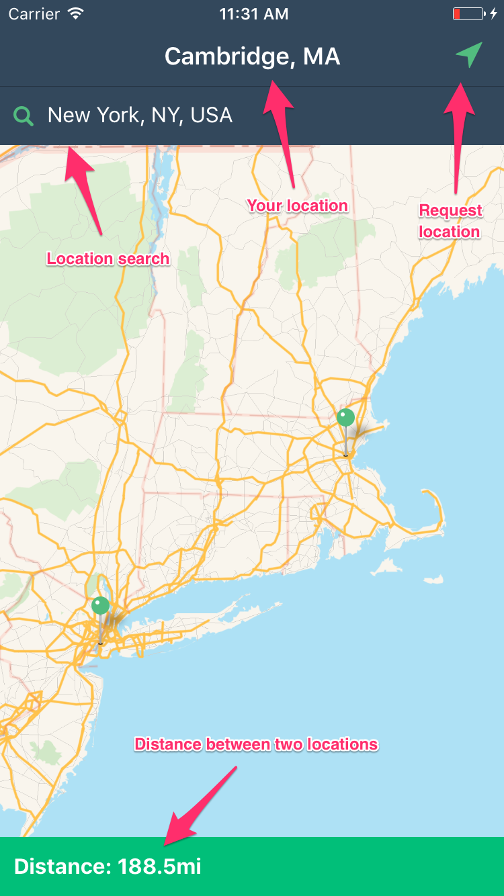

# distance-from-you

A simple iOS app for an interview.

This app does a few basic things:
1. Get's user location
2. Converts string input to proper location via Google's geocoding API
3. Displays distance between these two locations

